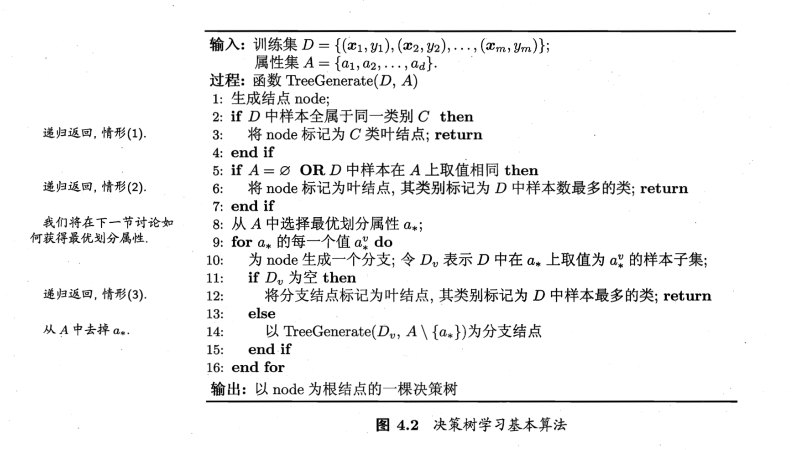
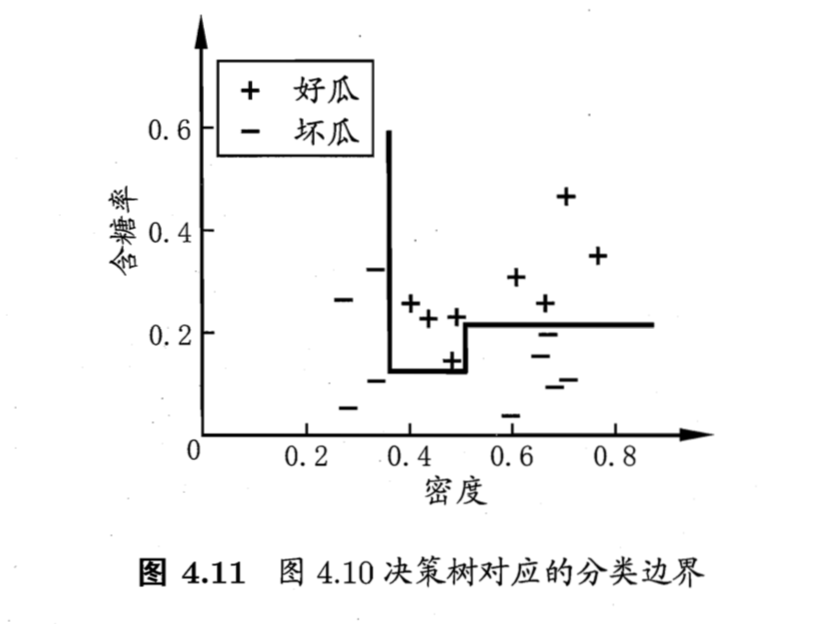
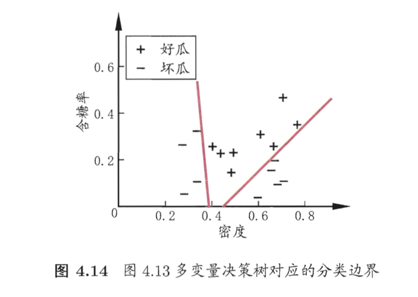

# Chapter 4 决策树

## Overview

决策树，根据属性构造节点进行划分，**可解释性强**

**情形 2 利用的是当前节点的后验分布，情形 3 利用当前节点的父类的先验分布**

## 划分选择

### Information Entropy Based

信息增益，衡量集合 $D$ 的纯度

$$ Ent(D)  = - \sum_{k=1}^{|Y|} p_k log_2 p_k $$

 $p_k$为 集合 $D$ 中 $k$ 类样本所占比例

通过选择属性划分前后的**信息熵**之差，即信息增益来作为选取划分属性的指标（ID3 算法）。 我们选取带来信息增益最大的属性划分作为最优划分属性。

然而，信息增益准则对可取值数目较多的属性有所偏好，**因为属性的分类越多，增益也就可能越大**（why?）。为解决这个问题，著名的 C4.5 算法 在增益值下面除以一个 $IV(a)$ 来缓解这一影响，类似进行一个 Normalization 操作：

$$ IV(a) = - \sum_{v=1}^{V} \frac{|D^v|}{|D|} log_2 \frac{|D^v|}{|D|} $$

然而，信息增益率可能对属性类别较少的属性具有偏好，因此将增益值和增益率结合，先选取**信息增益高于平均水平的属性，再从中选取增益率最高的属性**，来平衡这两个偏好。

### Gini Index Based

集合的纯度还可以使用基尼值（Gini Index）来度量：

$$ Gini(D) = 1 - \sum_{k=1}^{|Y|} p_k^2$$

CART 选择用基尼指数来进行最优划分属性的选择，属性 $a$的基尼指数定义为根据 $a$ 划分后各个属性类内加权的基尼指数之和，**选基尼指数最小的属性作为最优**。

### Comparison

Gini 指数的计算量较小，是标准库默认的划分方式；Entropy 的分类的树更为平衡

## 剪枝处理

剪枝是决策树学习算法防止过拟合的手段，因为分支太多，会 overfitting。 

泛化性能的判断：根据 Validation Set 上的效果（信息增益 etc）进行判断

### 预剪枝

在决策树生成过程中，对每个节点在划分之前进行估计，若不能带来泛化能力的提升，则停止分裂并将当前节点标记为叶子节点。

Advantage：降低过拟合、减少训练开销；

Disadvantages：贪心策略，可能不是全局最优，造成欠拟合

### 后剪枝

决策树生成后，自底向上对非叶子节点进行考察，若将其替换为叶子节点能带来泛化能力的提升，则替换之

Advantage：欠拟合风险小，泛化性能一般优于预剪枝

Disadvantage：训练开销大

## 连续和缺失

### 连续属性值

前面提到的属性如果取值是连续的，即其属性集合大小不再是有限的，通过**连续属性离散化**将其转化为离散，最简单的策略即**二分法**：判断某一属性值是否大于 threshold ，这个阈值一般可以设置为不大于属性取值中位数的最大值，从而确保阈值在训练集中出现过。

### 缺失值处理

给样本的缺失属性值进行补全，补全是基于有属性的样本的属性取值概率的权重进行。从而使样本以不同概率划入到不同的节点中去。

## 多变量决策树

决策树实质是在一个高维空间中，利用与坐标轴平行的分类边界对样本进行划分。**从而，每一个划分对应了某个属性的取值，具有较好的可解释性**。而在一些复杂的情况下，边界可能需要很多段划分才能够实现，比如：

斜的划分边界能提高效率，多变量决策树即使这样一种解决方式。**其非叶节点不再仅针对某个属性，而是对属性的线性组合进行测试**，即每个节点都是一个感知机，从而习得斜线分类边界:

